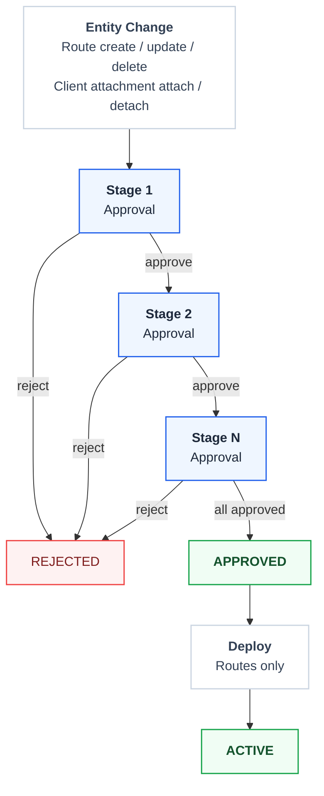
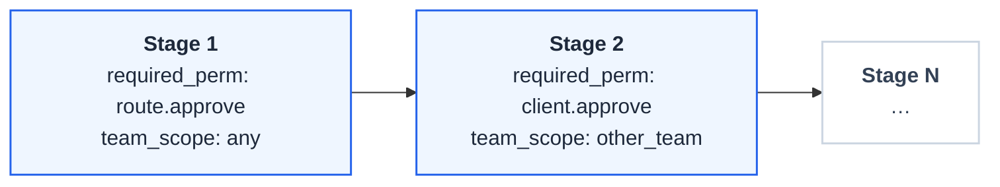

# Approval Workflow

FastGateway implements a **unified multi-stage approval system** for all change requests. Both route changes and client attachments go through the same approval pipeline with configurable stages.

## Unified Approval Flow



## Approval Entities

The unified system handles two entity types:

| Entity Type | Actions | Default Stages |
|-------------|---------|----------------|
| **Route** | create, update, delete | 1 stage: `route.approve` permission |
| **Client Attachment** | attach, detach | 2 stages: cross-team approval |

## Route Statuses

| Status | Description |
|--------|-------------|
| `pending_create` | New route submitted, awaiting approval |
| `pending_update` | Route update submitted, awaiting approval |
| `pending_delete` | Route deletion submitted, awaiting approval |
| `approved` | All approval stages passed, ready for deployment |
| `pending_deploy` | Approved and awaiting deployment to Kubernetes |
| `active` | Deployed and running in Kubernetes |
| `rejected` | Approval denied with reason |

## Attachment Statuses

| Status | Description |
|--------|-------------|
| `pending_attach` | New attachment submitted, awaiting approval |
| `pending_detach` | Detachment requested, awaiting approval |
| `approved` | All approval stages passed |
| `active` | Attachment is live (route deployed with this client) |
| `rejected` | Approval denied |
| `removed` | Attachment has been detached |

## Approval Stages

Each approval consists of one or more **stages** that must be completed sequentially:



### Stage Configuration

Each stage has:

| Field | Description |
|-------|-------------|
| `order` | Sequential order (1, 2, 3...) |
| `required_permission` | Permission needed to approve (e.g., `route.approve`) |
| `team_scope` | Which team(s) can approve |

### Team Scope Values

| Scope | Description |
|-------|-------------|
| `any` | Any user with the required permission in the project |
| `other_team` | User must be from a different team than the submitter |
| `submitter_team` | User must be from the submitter's team |

## Default Approval Policies

When a project is created, these default policies are seeded:

### Route approvals (single stage)

Route changes need one approval from any user with the `route.approve` permission (team scope `any`).

### Client attachment approvals (two stages)

Client attachments need two sequential approvals:

1. A member from a different team than the submitter approves (team scope `other_team`), for cross-team validation.
2. Any user with `client.approve` finalizes the request (team scope `any`).

## Approval Rules

### Submitter Constraint

**Users cannot approve their own submissions**, even if they have the required permission. This ensures separation of duties.

### Sequential Approval

Stages must be approved in order. Stage N cannot be approved until all stages 1 through N-1 are approved.

### Rejection Behavior

- **Any rejection fails the entire approval** — the overall status becomes `rejected`
- Remaining pending stages stay as-is (not auto-rejected)
- A rejected request must be re-submitted as a new request

### Owner Bypass

System owners (role: `owner`) can approve any stage regardless of team restrictions, but still cannot self-approve.

## Permission Matrix

| Action | Viewer | Editor | Approver | Admin | Owner |
|--------|--------|--------|----------|-------|-------|
| Submit route change | - | ✓ | - | ✓ | ✓ |
| Approve route (others') | - | - | ✓ | ✓ | ✓ |
| Approve own route | - | - | - | - | - |
| Deploy approved route | - | ✓ | ✓ | ✓ | ✓ |
| Submit attachment | - | ✓ | - | ✓ | ✓ |
| Approve attachment (others') | - | - | ✓ | ✓ | ✓ |
| Approve own attachment | - | - | - | - | - |

## API Endpoints

### List Approvals

```
GET /api/v1/projects/:projectId/approvals?status=pending&entityType=route
```

Filters:
- `status`: `pending`, `approved`, `rejected`
- `entityType`: `route`, `client_attachment`

### Approve a Stage

```
POST /api/v1/projects/:projectId/approvals/:approvalId/stages/:stageId/approve
```

### Reject a Stage

```
POST /api/v1/projects/:projectId/approvals/:approvalId/stages/:stageId/reject
Body: { "comment": "Reason for rejection" }
```

## Benefits

- **Unified workflow**: Single approval system for all entity types
- **Configurable stages**: Projects can customize approval requirements
- **Cross-team validation**: Client attachments require multi-team approval
- **Audit trail**: Full history of submissions, approvals, and rejections
- **Separation of duties**: Submitters cannot self-approve
- **Permission-based**: Fine-grained control over who can approve what
