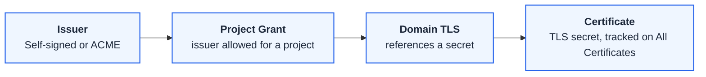

# Certificate Management

FastGateway manages the TLS certificates that secure your HTTPS domains. You register an issuer once, grant it to the projects that may use it, and FastGateway issues certificates from it as Kubernetes TLS secrets. Certificates are backed by cert-manager, so there is no certificate file to upload by hand.

## How It Works

1. Register an **issuer** (self-signed or ACME).
2. Grant the issuer to a **project**.
3. A domain's TLS references a secret, and FastGateway issues the certificate from the granted issuer into that secret.
4. Track every certificate on the **All Certificates** page.

## Issuers

Issuers are managed under *Certificate → Issuers* and are owner-only. FastGateway supports two types.

| Type | Use it for | Key settings |
|------|-----------|--------------|
| Self-signed CA | Internal services, testing, demos | Common name, key algorithm (RSA or ECDSA), key size (2048 or 4096), duration |
| ACME | Publicly trusted certificates | ACME server (Let's Encrypt production or staging, ZeroSSL, or a custom URL), an account email, and a DNS provider credential |

ACME issuance uses the DNS-01 challenge, so it reuses the same DNS provider credentials (Cloudflare, AWS Route 53, Google Cloud DNS) you register for [DNS Management](./dns-management.md).

### Granting an issuer to a project

A project cannot use an issuer until it is granted access. On the issuer's page, under *Grant Project Access*, pick a project and grant it. A project can only issue certificates from issuers it has been granted.

## Certificates

A certificate is a Kubernetes TLS secret that FastGateway issues from a granted issuer. There are two kinds.

| Usage | Purpose |
|-------|---------|
| Server | Terminates HTTPS for a domain (the common case) |
| Client | Used for mutual TLS, where clients present their own certificate |

A domain references its server certificate by *TLS Secret Name* (see [Domains](./domains.md)). Once the domain's TLS is configured and the project has a granted issuer, FastGateway requests the certificate and populates the secret.

### Certificate status

The **All Certificates** page lists every managed certificate across your projects, filterable by status and usage. Each certificate reports one status.

| Status | Meaning |
|--------|---------|
| Pending | Queued, waiting for issuance to start |
| Issuing | cert-manager is obtaining the certificate (for ACME, completing the DNS-01 challenge) |
| Ready | The certificate is issued and the secret is populated |
| Error | Issuance failed, for example an invalid ACME account, a DNS-01 challenge that could not be completed, or a missing credential |

## Related

- [Domains](./domains.md) reference a certificate by TLS Secret Name.
- [DNS Management](./dns-management.md) provides the DNS provider credentials that ACME uses for the DNS-01 challenge.
