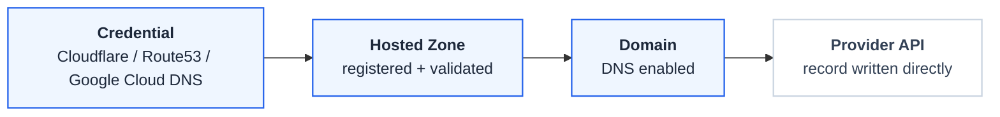

# DNS Management

FastGateway can manage a DNS record for each domain, pointing its hostname at the gateway's load-balancer address. FastGateway writes records **directly** to your DNS provider's API — there is no external-dns installation, no custom resource, and no extra component to run in your cluster.

## How It Works

DNS management has three parts, set up in order:

1. **Register a DNS provider credential** — an owner adds the API credential for Cloudflare, AWS Route 53, or Google Cloud DNS. This is the same credential registry used for ACME DNS-01 certificate issuance, so if you've already added a credential for certificates, you can reuse it here.
2. **Register a hosted zone** — an owner registers the zone you want FastGateway to manage (e.g., `example.com`) and selects which credential to use for it. FastGateway validates the zone against the provider and caches the provider's zone id for later writes.
3. **Enable DNS on a domain** — in a domain's DNS section, pick a registered hosted zone whose name is the domain's apex or a parent of its hostname. FastGateway resolves the gateway's load-balancer address and writes the record for you.

## Registering a DNS Provider Credential

Credentials are managed under **DNS settings** and are owner-only. FastGateway supports three providers:

| Provider | Credential fields |
|----------|--------------------|
| Cloudflare | API token |
| AWS Route 53 | Access key id, secret access key, and an optional region (defaults to `us-east-1`) |
| Google Cloud DNS | Service account key (JSON) and project |

You can register more than one credential — for example, separate credentials per provider, or per account — and each hosted zone picks the credential it uses when it's registered.

## Registering a Hosted Zone

Once a credential exists, an owner registers the hosted zone(s) FastGateway should manage:

1. Provide the zone name (e.g., `example.com`).
2. Select the credential to use for that zone.

FastGateway calls the provider's API to confirm the zone exists and is reachable with that credential, and caches the provider's zone id so later record writes don't need to look it up again. If validation fails — the zone doesn't exist, the credential doesn't have access to it, or the credential itself is invalid — the hosted zone is left in an **error** status so you can fix the credential or remove the zone.

## Enabling DNS on a Domain

From a domain's DNS section, you can enable DNS management by selecting a registered hosted zone. The domain's hostname must be the zone's apex (e.g., hostname `example.com` for zone `example.com`) or a subdomain of it (e.g., hostname `api.example.com` for zone `example.com`) — FastGateway matches the domain to a zone this way rather than asking you to pick a record type up front.

Once enabled, FastGateway:

- Resolves the domain's Gateway load-balancer address.
- Writes an `A`/`AAAA` record if the address is an IP, or a `CNAME` if it's a hostname. Choosing `auto` lets FastGateway pick the right type for you.
- Never overwrites a record it doesn't already manage — if a record with the same name already exists at the provider and FastGateway didn't create it, DNS management for that domain reports an error instead of clobbering it.

DNS management works for HTTP domains (port 80, no TLS) as well as HTTPS domains — it isn't gated on TLS being enabled.

## Record Status

Each domain's managed DNS record reports one of three statuses:

| Status | Meaning |
|--------|---------|
| **Pending** | Waiting for the Gateway to report a load-balancer address; FastGateway retries briefly until one is available |
| **Ready** | The record has been written to the provider |
| **Error** | Something is misconfigured — for example, a `CNAME` requested at the zone apex, a hosted-zone mismatch with the domain's hostname, or an invalid credential |

## Limitations

- **Three providers in v1.** Cloudflare, AWS Route 53, and Google Cloud DNS. Other providers aren't supported yet.
- **One record per domain.** FastGateway manages a single DNS record per domain — the one pointing its hostname at the gateway's address.
- **FastGateway's own domains only.** DNS management only writes records for domains FastGateway manages (its Gateway resources) — it does not manage unrelated records in your zone, and it won't touch a pre-existing record it doesn't own.
