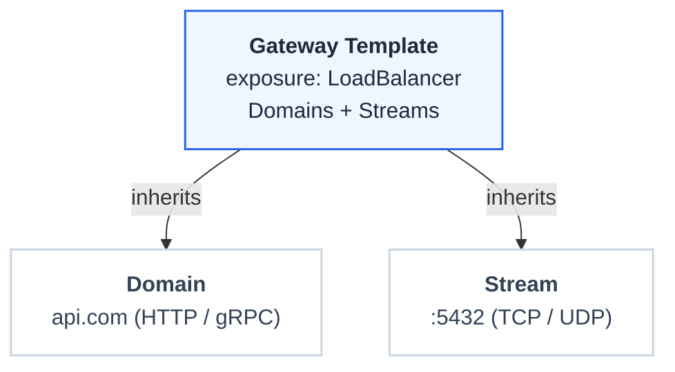

# Gateway Templates

A Gateway template is a reusable Gateway infrastructure profile. It defines the settings that domains and streams inherit, so Gateways stay consistent across your API infrastructure. Each template generates a GatewayClass and EnvoyProxy that back the Gateways created from it.

Gateway templates are managed under the Gateway Templates section. Earlier versions called them Domain Templates, and the API path is still `/domain-templates`.

## Capabilities

A template is enabled for domains, streams, or both. At least one capability is required.

| Capability | Covers | Default |
|------------|--------|---------|
| Enable for Domains | Domains (HTTP, HTTPS, gRPC routes) can use this template | On |
| Enable for Streams | Streams (TCP, UDP routes) can use this template | Off |

The Domain create form lists templates that have Domains enabled, and the Stream create form lists templates that have Streams enabled. A template with both enabled appears in both. The HTTP, HTTPS, and TLS settings below are domain listener defaults, so they apply only when Domains is enabled.

## Template Properties

| Property | Description | Options |
|----------|-------------|---------|
| Exposure Type | Service type for the Gateway | `LoadBalancer` (internet-facing), `ClusterIP` (cluster-only) |
| HTTP Port | HTTP listener port (domains) | Default `80` |
| HTTPS Port | HTTPS listener port (domains) | Default `443` |
| TLS Mode | Which listeners to create (domains) | `tls_only`, `no_tls`, `both` |
| TLS Policy | Certificate handling (domains) | `terminate`, `passthrough` |
| Annotations | Custom metadata | Key-value pairs for load balancer configuration |
| Controller Name | GatewayClass controller | Default Envoy Gateway controller |
| Merge Gateways | Share a single Envoy deployment across Gateways | `true`, `false` |
| Observability | Access logs, tracing, and metrics | Optional telemetry configuration |

## How Templates Work

## Common Template Patterns

| Template Name | Use Case |
|---------------|----------|
| Public HTTPS | Internet APIs with TLS termination (Domains) |
| Internal HTTP | Cluster-internal services (Domains) |
| Public Passthrough | mTLS or custom certificate handling (Domains) |
| TCP/UDP Streams | Expose databases or other Layer-4 services (Streams) |

## Benefits

- **Consistency**: All domains and streams using a template share the same baseline configuration
- **Efficiency**: Update the template to change all associated Gateways
- **Compliance**: Enforce organizational standards through template policies

Templates reduce configuration drift and simplify Gateway management at scale.
