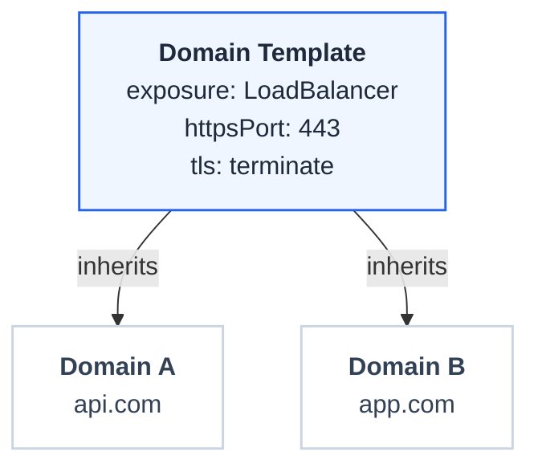

# Domain Templates

Domain templates define reusable Gateway settings that domains can inherit, ensuring consistent configuration across your API infrastructure.

## Template Properties

| Property | Description | Options |
|----------|-------------|---------|
| Exposure Type | Service type for the Gateway | `LoadBalancer` (internet-facing), `ClusterIP` (cluster-only) |
| HTTP Port | HTTP listener port | Default `80` |
| HTTPS Port | HTTPS listener port | Default `443` |
| TLS Mode | Which listeners to create | `tls_only`, `no_tls`, `both` |
| TLS Policy | Certificate handling | `terminate`, `passthrough` |
| Annotations | Custom metadata | Key-value pairs for load balancer configuration |
| Controller Name | GatewayClass controller | Default Envoy Gateway controller |
| Merge Gateways | Share a single Envoy deployment across Gateways | `true`, `false` |
| Observability | Access logs, tracing, and metrics | Optional telemetry configuration |

## How Templates Work

## Common Template Patterns

| Template Name | Use Case |
|---------------|----------|
| Public HTTPS | Internet APIs with TLS termination |
| Internal HTTP | Cluster-internal services |
| Public Passthrough | mTLS or custom certificate handling |

## Benefits

- **Consistency**: All domains using a template share the same baseline configuration
- **Efficiency**: Update the template to change all associated domains
- **Compliance**: Enforce organizational standards through template policies

Templates reduce configuration drift and simplify domain management at scale.
