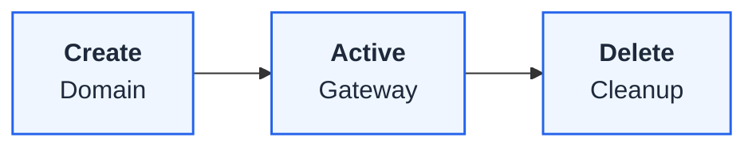

# Domains

Domains represent Kubernetes Gateway resources, defining the entry points for your API traffic with hostname and TLS configuration.

## What is a Domain?

A domain maps to a single Kubernetes Gateway resource with:

- **Hostname**: The DNS name clients use to access your APIs (e.g., `api.example.com`)
- **TLS Configuration**: Certificate and encryption settings
- **Template Reference**: Inherited settings from a domain template

## Domain to Gateway Mapping

| Domain Setting | Gateway Resource |
|----------------|------------------|
| Hostname | `spec.listeners[].hostname` |
| Port | `spec.listeners[].port` |
| TLS Mode | `spec.listeners[].tls.mode` |
| Certificate | `spec.listeners[].tls.certificateRefs` |

## Domain Lifecycle

When you create a domain:
1. FastGateway validates the configuration
2. Creates the Gateway resource in Kubernetes
3. Envoy Gateway provisions the listener

## Relationship to Routes

Domains serve as parent resources for routes:

- Multiple routes can attach to one domain
- Routes reference the domain's Gateway in their `parentRefs`
- Deleting a domain removes all associated routes

Each domain represents a distinct API endpoint in your infrastructure.
