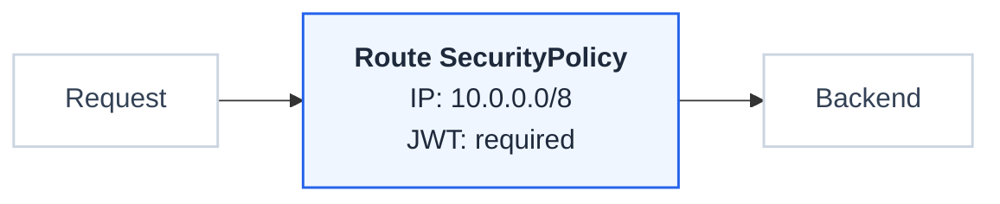
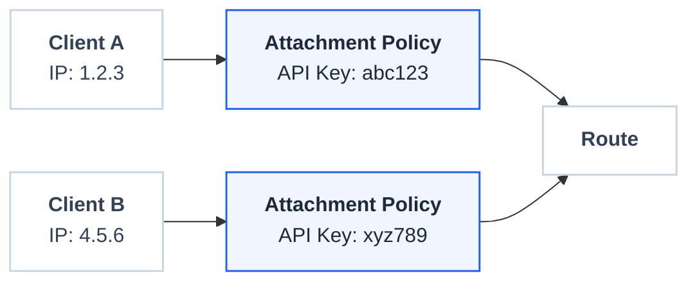

# Security Modes

FastGateway offers two mutually exclusive security modes for protecting routes: General and Client mode.

## Mode Comparison

| Feature | General Mode | Client Mode |
|---------|--------------|-------------|
| IP Filtering | Route-level allowlist | Per-client IPs |
| API Keys | Route-level keys | Per-client keys |
| JWT Validation | Route-level | Per-client (via attachments) |
| mTLS | Not supported | Per-client (via attachments) |
| OIDC Authentication | Supported | Not supported |
| Granularity | All consumers same rules | Per-consumer rules |

## General Mode

Applies security policies at the route level:

**Best for**: Public APIs, internal services with uniform access requirements.

## Client Mode

Applies security policies per client attachment:

**Best for**: Partner APIs, multi-tenant platforms, differentiated access.

## Important Notes

- Modes are **mutually exclusive** per route
- Cannot mix General and Client security on the same route
- Route-level JWT is only available in General mode; in Client mode, JWT and mTLS are configured per client via client attachments
- OIDC is only available in General mode
