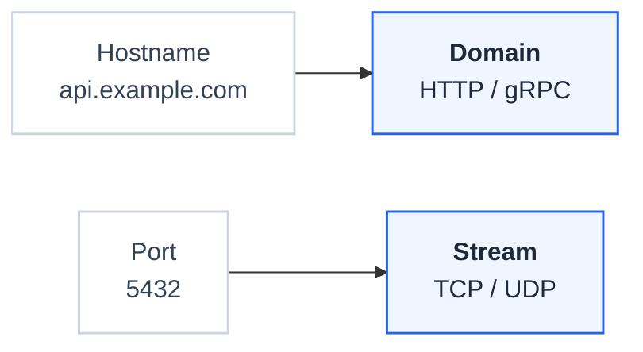

# Streams

Streams expose Layer-4 (TCP and UDP) services through FastGateway, the way [Domains](./domains.md) expose HTTP and gRPC. A Stream is keyed by a listener port rather than a hostname, so you can route non-HTTP traffic such as databases, message brokers, and DNS through the same control plane, approvals, and audit trail you already use for HTTP routes.

## Domains and Streams

FastGateway splits routing on how traffic is addressed:

> Hostname to Domain. Port to Stream.

HTTP and gRPC are hostname-keyed and live on Domains, where they match on hostname, path, header, method, and query. TCP and UDP are port-keyed and live on Streams, where they route purely by listener port. A Stream is the Layer-4 sibling of a Domain, without hostname, TLS, certificate, or DNS.

| | Domain | Stream |
|--|--------|--------|
| Keyed by | Hostname | Listener port |
| Protocols | HTTP, gRPC | TCP, UDP |
| Matching | Path, header, method, query | None, port only |
| Gateway API resource | HTTPRoute, GRPCRoute | TCPRoute, UDPRoute |
| TLS, certificate, DNS | Yes | No |

## What is a Stream?

A Stream is a port-keyed entry point. One Stream maps to one Kubernetes Gateway whose listeners are TCP or UDP ports. It references a Gateway Template that has the Stream capability enabled (see [Gateway Templates](./domain-templates.md)), which supplies the GatewayClass and EnvoyProxy configuration, exactly as a Domain does. The template is chosen at creation and cannot be changed afterward.

| Property | Description |
|----------|-------------|
| Name | Lowercase DNS-label name, unique within the project |
| Namespace | Kubernetes namespace for the Stream's Gateway and route resources |
| Gateway Template | Supplies the GatewayClass and EnvoyProxy. Must have the Stream capability. Immutable |
| Load balancer address | External IP or hostname of the Stream's Gateway |
| Status | `pending`, `active`, or `error` |

When you create a Stream, FastGateway provisions its Gateway eagerly, so the load balancer address appears before you add any route. A Stream with no routes is still a valid Gateway. Deleting a Stream is blocked while it still has routes, so you remove the routes first.

## L4 Routes

An L4 route maps a Stream's listener port to a weighted pool of backends. It is deployed as a Gateway API `TCPRoute` or `UDPRoute` on Envoy Gateway. L4 routes carry no hostname, path, or header matching. Traffic that arrives on the listener port is forwarded to the backends.

Backends are in-cluster Kubernetes Services. Add more than one to split traffic by weight. The listener port is the port the load balancer exposes; each backend's own service port can differ.

L4 routes flow through the same [approval workflow](./approval-workflow.md) as HTTP routes and are governed by the same project RBAC. A route becomes active once it is approved and its `TCPRoute` or `UDPRoute` is deployed.

## TCP and UDP Capabilities

TCP and UDP support different subsets of backend traffic policy, reflecting what applies to a connection versus a datagram.

| Policy | TCP | UDP |
|--------|-----|-----|
| Load balancing (RoundRobin, Random, LeastRequest) | Yes | Yes |
| Circuit breaker (max connections, max requests per connection) | Yes | No |
| Health check (active TCP probe) | Yes | No |
| TCP timeouts | Yes | No |

UDP routes support load balancing only. Circuit breaking and health checks do not meaningfully apply to datagrams.

## Listener Ports

A listener is identified by its transport and port, so a port can be used once per protocol on a Stream. `tcp:53` and `udp:53` can coexist, while two `tcp:5432` routes cannot. Ports must be between 1 and 65535, and some ports are reserved (for example Envoy's internal admin ports, and a merged template's HTTP and HTTPS ports).

The route form checks for a port collision live as you type. The backend enforces the same rule and rejects a conflicting port with HTTP 409, including collisions across Domains and Streams that share a merged Gateway Template.

## Observability

Stream and L4 route detail pages show basic Layer-4 metrics read from Envoy's TCP and UDP proxy stats:

- Active connections (TCP) or sessions (UDP)
- Connection rate, new connections per second
- Throughput, bytes received and sent

Layer-4 traffic has no request, latency, or error-rate metrics, so those HTTP cards do not appear.

## Limits

L4 routing targets non-HTTP services and intentionally leaves out Layer-7 features:

- Backends are in-cluster Kubernetes Services only. External FQDN or IP backends are not supported.
- No TLS termination and no TLS passthrough (`TLSRoute`).
- No Layer-7 features: no path, header, method, or query matching, filters, redirects, URL rewrites, header modifiers, CORS, WAF, security modes, client attachments, rate limiting, or retries.

## Use Cases

Streams suit services that speak their own protocol over a port rather than HTTP:

| Service | Protocol |
|---------|----------|
| PostgreSQL, MySQL | TCP |
| Redis | TCP |
| Kafka | TCP |
| DNS | TCP and UDP |
| Syslog | UDP |
| Game servers | TCP or UDP |

## Related

- [Routes](./routes.md) covers HTTP and gRPC routing on Domains.
- [Domains](./domains.md) are the hostname-keyed sibling of Streams.
- [Gateway Templates](./domain-templates.md) supply the Gateway configuration a Stream references.
